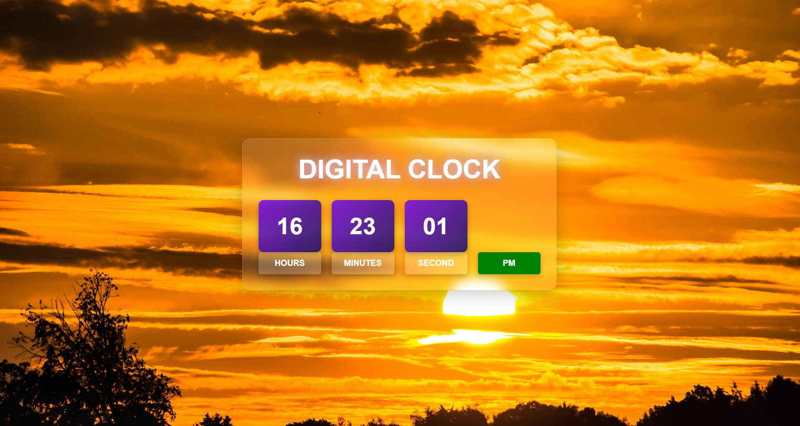
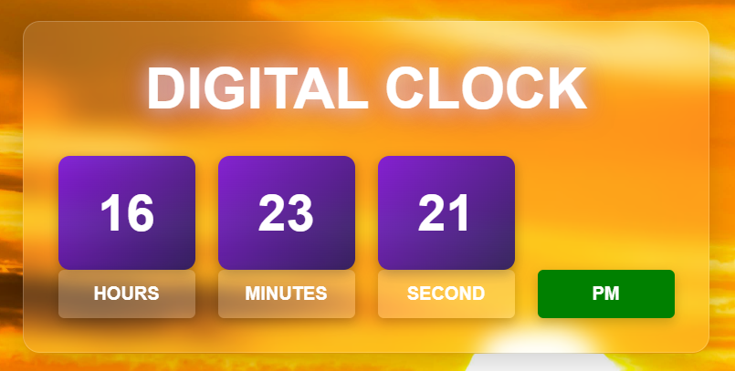

# Digital Clock

A simple digital clock built using HTML, CSS and JavaScript.

## Features
- Shows current time in real-time
- Updates every second
- Clean and responsive design
- Uses JavaScript Date object

## Technologies Used
- HTML
- CSS
- JavaScript

## Live Demo
https://Shubham-code05.github.io/digital-clock/

## Screenshots

### Main Screen

### Running Clock

